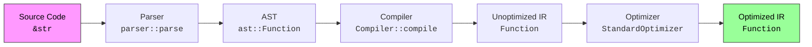
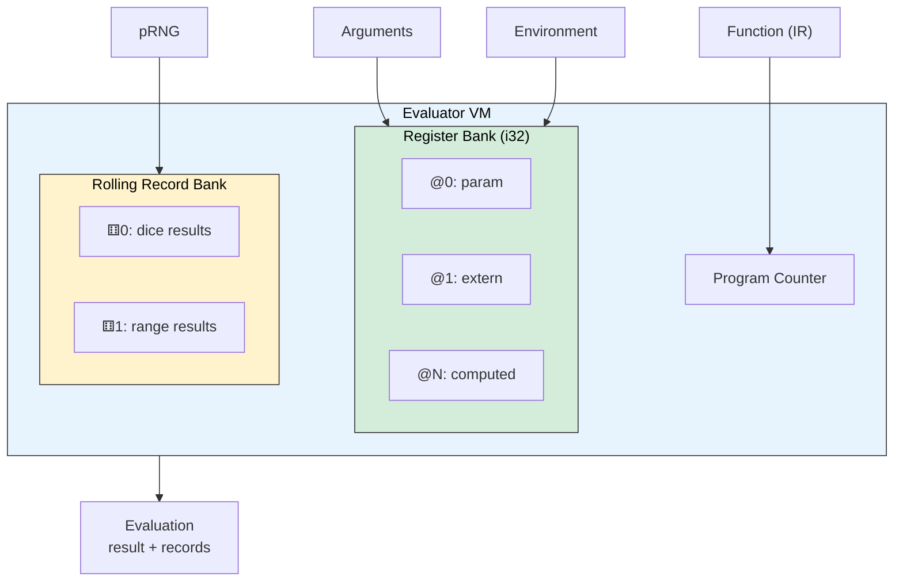
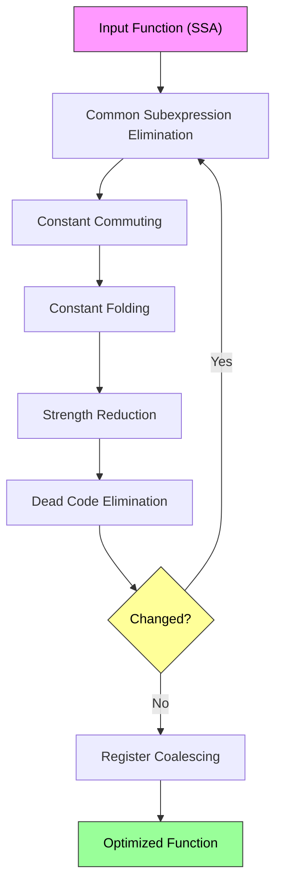

# xDy crate

The `xdy` crate is the core library of the xDy project. It compiles dice expressions into reusable functions, optimizes them, and evaluates them against client-supplied pseudorandom number generators. For a high-level overview of the project, language features, and usage examples, see the [project README](../README.md).

This document covers the internal architecture for contributors and curious power users.

* [Architecture](#architecture)
	* [Compilation pipeline](#compilation-pipeline)
	* [Intermediate representation](#intermediate-representation)
	* [Evaluator](#evaluator)
	* [Optimizer](#optimizer)
	* [Histogram engine](#histogram-engine)
	* [Diagnostics](#diagnostics)
* [Instruction set reference](#instruction-set-reference)
	* [Addressing modes](#addressing-modes)
	* [Roll instructions](#roll-instructions)
	* [Drop instructions](#drop-instructions)
	* [Reduce instructions](#reduce-instructions)
	* [Arithmetic instructions](#arithmetic-instructions)
	* [Control instructions](#control-instructions)
* [Cargo features](#cargo-features)
* [Safety](#safety)

## Architecture

### Compilation pipeline

Source code flows through a six-stage pipeline. The `compile()` convenience function drives the full pipeline; `compile_unoptimized()` skips the optimizer.

**Parser.** A [nom](https://docs.rs/nom)-based combinator parser recognizes the xDy grammar and produces an abstract syntax tree (`ast::Function`). The grammar supports operator precedence via recursive descent: `add_sub` → `mul_div_mod` → `unary` → `exponent` → `primary`. See `parser::combinators` for the full set of production rules; the Rustdoc includes a railroad diagram generated from the EBNF grammar.

**Compiler.** The `Compiler` implements the `ASTVisitor` trait and walks the AST in a single pass to emit IR instructions. It uses static single assignment (SSA) form — every instruction writes to a fresh register or rolling record. Parameters are allocated first (in declaration order), then external variables (depth-first, left-to-right), ensuring deterministic register layout.

**Optimizer.** The `StandardOptimizer` applies five transformation passes in a fixed-point loop, then a final register coalescing pass. See [Optimizer](#optimizer) below.

### Intermediate representation

The IR is a simple register transfer language (RTL) with no control flow — all instructions reside in a single basic block. The machine model provides two register files:

- **Register bank** (`@0`, `@1`, …): holds `i32` values for parameters, external variables, and computed intermediates.
- **Rolling record bank** (`⚅0`, `⚅1`, …): holds the individual results of dice rolls and range selections, along with drop counters.

Each operand uses one of three addressing modes:

| Mode | Notation | Description |
|------|----------|-------------|
| Immediate | `#N` | Constant `i32` embedded in the instruction |
| Register | `@N` | Index into the register bank |
| RollingRecord | `⚅N` | Index into the rolling record bank |

See [Instruction set reference](#instruction-set-reference) for the complete ISA.

### Evaluator

The evaluator is a linear instruction interpreter. For each evaluation it:

1. Allocates a register bank (sized at compile time) and a rolling record bank.
2. Loads arguments into parameter registers and environment bindings into external variable registers.
3. Walks the instruction stream sequentially — there is no branching, so the program counter simply increments.
4. Returns the final `Evaluation`, which includes both the `i32` result and the complete `Vec<RollingRecord>` for display.

All arithmetic saturates to `i32::MIN`/`i32::MAX`. Division by zero yields zero. `0^0 = 1`. Negative exponents yield zero.

The evaluator also provides `bounds()`, which computes static `min`/`max` bounds and (when possible) the total outcome count — without requiring an RNG.

### Optimizer

The `StandardOptimizer` applies six passes. The first five run in a fixed-point loop; the sixth runs once at the end:

| Pass | Effect |
|------|--------|
| **CSE** | Identifies identical instructions and replaces duplicates with references to the first occurrence |
| **Constant commuting** | Moves immediate operands to the left side of commutative operators, creating folding opportunities |
| **Constant folding** | Evaluates instructions whose operands are all immediates at compile time |
| **Strength reduction** | Replaces expensive operations with cheaper equivalents (e.g., multiply by power of two → shift) |
| **Dead code elimination** | Removes instructions whose results are never consumed |
| **Register coalescing** | Merges equivalent registers to reduce the register bank size; breaks SSA form, so it runs last |

### Histogram engine

The histogram engine computes the complete probability distribution of a dice expression by exhaustive enumeration. It uses a state-machine approach:

1. Each `EvaluationState` suspends at roll/range instructions.
2. For each possible outcome of the suspended instruction, a successor state is generated.
3. States that reach `Return` contribute their result to the histogram.
4. A configurable gas tank (`MAX_SUCCESSORS = 30`) bounds the branching factor per instruction.

Two builders are provided: `SerialHistogramBuilder` and `ParallelHistogramBuilder` (the latter requires the `parallel-histogram` feature and uses `rayon`).

### Diagnostics

The `diagnostics` module provides structured error reporting with a fix-and-retry strategy. When parsing fails, the diagnostics engine:

1. Analyzes the parse error to identify the failure kind (unclosed delimiter, missing operand, etc.).
2. Applies a minimal fix to the source text.
3. Re-parses the fixed source to discover additional errors.
4. Maps error spans back to the original source using an offset map.

This produces rich `Diagnostic` values with error kinds, source spans, messages, and suggested fixes — designed to power IDE-style error reporting on every keystroke.

## Instruction set reference

### Addressing modes

| Mode | Syntax | Description |
|------|--------|-------------|
| `Immediate(N)` | `#N` | Constant `i32` value |
| `Register(N)` | `@N` | General-purpose register |
| `RollingRecord(N)` | `⚅N` | Rolling record (dice/range results) |

### Roll instructions

| Instruction | Syntax | Semantics |
|-------------|--------|-----------|
| `RollRange` | `⚅N ← roll range S:E` | Select a random value from the inclusive range `[S, E]` and store it in rolling record `N` |
| `RollStandardDice` | `⚅N ← roll standard dice CDF` | Roll `C` standard dice with `F` faces each, storing all results in rolling record `N` |
| `RollCustomDice` | `⚅N ← roll custom dice CD[f₁, f₂, …]` | Roll `C` custom dice with the specified face values, storing all results in rolling record `N` |

### Drop instructions

| Instruction | Syntax | Semantics |
|-------------|--------|-----------|
| `DropLowest` | `⚅N ← drop lowest K from ⚅N` | Mark the `K` lowest results in rolling record `N` as dropped |
| `DropHighest` | `⚅N ← drop highest K from ⚅N` | Mark the `K` highest results in rolling record `N` as dropped |

### Reduce instructions

| Instruction | Syntax | Semantics |
|-------------|--------|-----------|
| `SumRollingRecord` | `@N ← sum rolling record ⚅M` | Sum the non-dropped results of rolling record `M` into register `N` (saturating) |

### Arithmetic instructions

All arithmetic instructions saturate on overflow/underflow.

| Instruction | Syntax | Semantics |
|-------------|--------|-----------|
| `Add` | `@N ← A + B` | Saturating addition |
| `Sub` | `@N ← A - B` | Saturating subtraction |
| `Mul` | `@N ← A * B` | Saturating multiplication |
| `Div` | `@N ← A / B` | Saturating division; `x / 0 = 0` |
| `Mod` | `@N ← A % B` | Saturating remainder; `x % 0 = 0` |
| `Exp` | `@N ← A ^ B` | Saturating exponentiation; `0^0 = 1`, `x^(-n) = 0` |
| `Neg` | `@N ← -A` | Saturating negation |

### Control instructions

| Instruction | Syntax | Semantics |
|-------------|--------|-----------|
| `Return` | `return A` | Set the function result to `A` and terminate |

## Cargo features

| Feature | Default | Description |
|---------|---------|-------------|
| `parallel-histogram` | Yes | Parallel probability distribution computation via `rayon` |
| `serde` | Yes | `Serialize`/`Deserialize` for IR, evaluation, and histogram types |

## Safety

`xDy` is designed to be well-behaved for all inputs. Dice expression values are `i32` and all arithmetic operations saturate on overflow or underflow. Neither the compiler nor evaluator should panic or cause undefined behavior, even for invalid dice expressions and inputs, though client misuse of vector results can lead to panics. The main crate contains no `unsafe` code.
