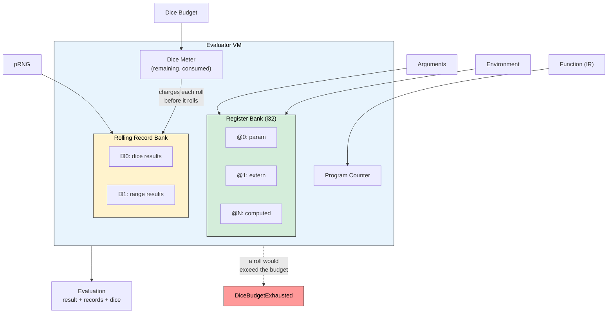
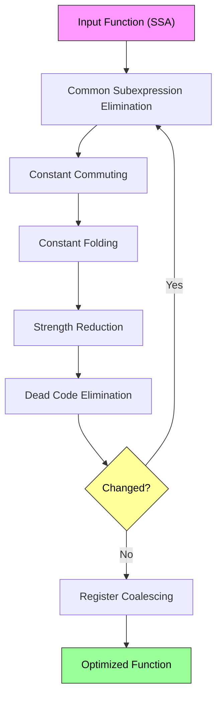
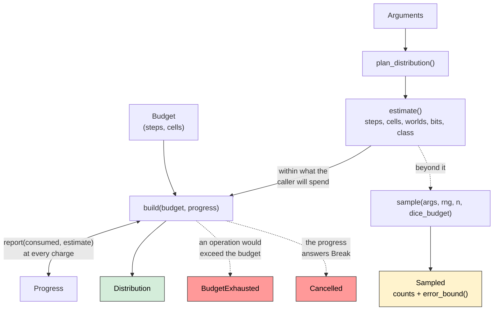
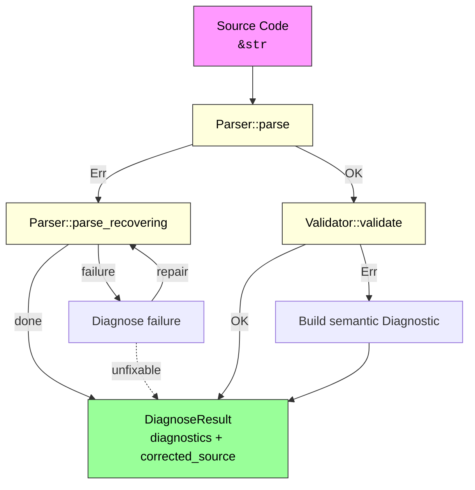

# xDy crate

The `xdy` crate is the core library of the xDy project. It compiles dice expressions into reusable functions, optimizes them, and evaluates them against client-supplied pseudorandom number generators. For a high-level overview of the project, language features, and usage examples, see the [project README](../README.md).

This document covers the internal architecture for contributors and curious power users.

* [Architecture](#architecture)
	* [Compilation pipeline](#compilation-pipeline)
	* [Source spans](#source-spans)
	* [Semantic validation](#semantic-validation)
	* [Intermediate representation](#intermediate-representation)
	* [Evaluator](#evaluator)
	* [Optimizer](#optimizer)
	* [Distribution engine](#distribution-engine)
	* [Diagnostics](#diagnostics)
	* [Textual formats](#textual-formats)
* [Instruction set reference](#instruction-set-reference)
	* [Addressing modes](#addressing-modes)
	* [Roll instructions](#roll-instructions)
	* [Drop instructions](#drop-instructions)
	* [Reduce instructions](#reduce-instructions)
	* [Arithmetic instructions](#arithmetic-instructions)
	* [Control instructions](#control-instructions)
* [Cargo features](#cargo-features)
* [Safety](#safety)

## Architecture

### Compilation pipeline

Source code flows through a four-stage happy path: parse, validate, compile, optimize. The `compile()` convenience function drives the full pipeline; `compile_unoptimized()` skips the optimizer; the sad path (syntactic and semantic errors, rich diagnostics) is described in [Diagnostics](#diagnostics).

```mermaid
graph LR
    A["Source Code<br/><code>&str</code>"] --> B["Parser<br/><code>Parser::parse</code>"]
    B --> C["AST<br/><code>ast::Function</code>"]
    C --> V["Validator<br/><code>Validator::validate</code>"]
    V --> D["Compiler<br/><code>Compiler::compile</code>"]
    D --> E["Unoptimized IR<br/><code>Function</code>"]
    E --> F["Optimizer<br/><code>StandardOptimizer</code>"]
    F --> G["Optimized IR<br/><code>Function</code>"]
    style A fill:#f9f,stroke:#333,color:#000
    style G fill:#9f9,stroke:#333,color:#000
```

**Parser.** A [nom](https://docs.rs/nom)-based combinator parser recognizes the xDy grammar and produces an abstract syntax tree (`ast::Function`). The grammar supports operator precedence via recursive descent: `add_sub` → `mul_div_mod` → `unary` → `exponent` → `primary`. The recursive productions share an engine that performs the descent with an explicit stack on the heap, so parsing takes time linear in the length of the input and consumes no more of the machine stack for deeply nested input than for shallow input. See the `parser` module for the full set of production rules; its Rustdoc includes a railroad diagram generated from the EBNF grammar. Every AST node carries a `SourceSpan` referencing its byte range in the original input — see [Source spans](#source-spans) below.

**Validator.** The `Validator` performs semantic checks on the parsed AST before code generation. It catches duplicate formal parameter names and enforces the invariants of local bindings — use-before-bind (including self-reference), rebinding, and collision with a formal parameter — with room for further checks as downstream language features demand them. See [Semantic validation](#semantic-validation).

**Compiler.** The `Compiler` implements the `ASTVisitor` trait and walks the AST in a single pass to emit IR instructions. An `ASTVisitor` folds the AST bottom-up: optional `enter_*` hooks run before a node's children, and each `visit_*` method runs after them, receiving their outputs. The walk uses an explicit stack rather than recursion, so it handles ASTs of any depth. It uses static single assignment (SSA) form — every instruction writes to a fresh register or rolling record, except that a drop instruction marks the results of the rolling record that it modifies. Parameters are allocated first (in declaration order), then external variables (depth-first, left-to-right), ensuring deterministic register layout. Keeping validation as a separate pass lets the compiler's `ASTVisitor::Error` be `Infallible`.

**Optimizer.** The `StandardOptimizer` applies five transformation passes in a fixed-point loop, then a final register coalescing pass. See [Optimizer](#optimizer) below.

### Source spans

Every AST node carries a `SourceSpan { start, end }` byte range referencing the original source text. The `Spanned` trait provides uniform access to these spans (`span()`) and an `untethered()` operation that zeroes every span throughout a value, enabling position-independent structural comparison for tests and round-trip fidelity checks.

Spans flow end-to-end: parser combinators compute them from `nom_locate::LocatedSpan` positions; semantic errors (the `CompilationError` variants in the table below) carry the spans of both occurrences that conflict; diagnostics (`Diagnostic`, `RelatedLabel`) surface them as byte ranges in the original source. This layer is a prerequisite for the planned `xdy!` procedural macro (which translates compiler errors to `compile_error!` at token-precise spans) and for editor integrations that want to underline or gutter-highlight errors.

### Semantic validation

The `Validator` pass sits between parsing and code generation and rejects ASTs that are syntactically well-formed but semantically invalid. `Validator::validate()` is its entry point, and runs every check in a single walk. The `Validator` is an `ASTVisitor`, so a walk that drives it through `accept` performs the same checks.

The current checks:

| Error | Example | Payload |
|-------|---------|---------|
| `DuplicateParameter` | `{x}, {x}: {x} + 1` | name, first and duplicate occurrence spans |
| `BindingCollidesWithParameter` | `{x}: {x}@(3D6) + {x}` | name, parameter span, binding-site span |
| `DuplicateBinding` | `{x}@(3D6) + {x}@(1D4)`, `{x}@({x}@(1))` | name, first and duplicate binding-site spans |
| `UseBeforeBind` | `{x} + {x}@(3D6)` | name, reference span, binding-site span |

The binding checks (`BindingCollidesWithParameter`, `DuplicateBinding`, `UseBeforeBind`) enforce the single flat namespace and forward-only reference rules of subexpression naming; `UseBeforeBind` also rejects self-reference inside a bound expression, such as `{x}@(1 + {x})`. Additional checks will be added here as further language features land.

### Intermediate representation

The IR is a simple register transfer language (RTL) with no control flow — all instructions reside in a single basic block. The machine model provides two register files:

- **Register bank** (`@0`, `@1`, …): holds `i32` values for parameters, external variables, and computed intermediates.
- **Rolling record bank** (`⚅0`, `⚅1`, …): holds the individual results of dice rolls and range selections, along with drop counters.

Each operand uses one of three addressing modes:

| Mode | Notation | Description |
|------|----------|-------------|
| Immediate | `N` | Constant `i32` embedded in the instruction |
| Register | `@N` | Index into the register bank |
| RollingRecord | `⚅N` | Index into the rolling record bank |

See [Instruction set reference](#instruction-set-reference) for the complete ISA.

### Evaluator

The evaluator is a linear instruction interpreter. For each evaluation it:

1. Allocates a register bank (sized at compile time) and a rolling record bank.
2. Loads arguments into parameter registers and environment bindings into external variable registers.
3. Walks the instruction stream sequentially — there is no branching, so the program counter simply increments.
4. Returns the final `Evaluation`, which includes the `i32` result, the complete `Vec<RollingRecord>` for display, and the number of dice rolled.

```mermaid
graph TD
    subgraph VM["Evaluator VM"]
        direction TB
        PC["Program Counter"]
        subgraph RF["Register Bank (i32)"]
            R0["@0: param"]
            R1["@1: extern"]
            RN["@N: computed"]
        end
        subgraph RR["Rolling Record Bank"]
            RR0["⚅0: dice results"]
            RR1["⚅1: range results"]
        end
        DM["Dice Meter<br/>(remaining, consumed)"]
    end
    F["Function (IR)"] --> PC
    RNG["pRNG"] --> RR
    ARGS["Arguments"] --> RF
    ENV["Environment"] --> RF
    BUD["Dice Budget"] --> DM
    DM -->|"charges each roll<br/>before it rolls"| RR
    VM --> OUT["Evaluation<br/>result + records + dice"]
    VM -.->|"a roll would<br/>exceed the budget"| ERR["DiceBudgetExhausted"]
    style VM fill:#e8f4fd,stroke:#333,color:#000
    style RF fill:#d4edda,stroke:#333,color:#000
    style RR fill:#fff3cd,stroke:#333,color:#000
    style ERR fill:#f99,stroke:#333,color:#000
```

All arithmetic saturates to `i32::MIN`/`i32::MAX`. Division by zero yields zero. `0^0 = 1`. A negative exponent yields zero, except that `1^n = 1` and `(-1)^n = ±1` for every `n`.

`evaluate_metered()` evaluates within a caller-supplied dice budget. The IR never branches or loops, so every cost of evaluation beyond the size of the function is proportional to the dice rolled; each roll instruction charges its count against the budget, and one that would exceed it is refused with `DiceBudgetExhausted` before it draws from the RNG or allocates anything. Within the budget, metering never changes the RNG draws. Every `Evaluation` reports the dice it rolled in `dice`.

The evaluator also provides `bounds_over()`, which computes static `min`/`max` bounds, (when possible) the total outcome count, and the worst-case number of dice rolled — without requiring an RNG.

### Optimizer

The `StandardOptimizer` applies six passes. The first five run in a fixed-point loop; the sixth runs once at the end:

```mermaid
graph TD
    A["Input Function (SSA)"] --> B["Common Subexpression Elimination"]
    B --> C["Constant Commuting"]
    C --> D["Constant Folding"]
    D --> E["Strength Reduction"]
    E --> F["Dead Code Elimination"]
    F --> G{"Changed?"}
    G -- Yes --> B
    G -- No --> H["Register Coalescing"]
    H --> I["Optimized Function"]
    style A fill:#f9f,stroke:#333,color:#000
    style I fill:#9f9,stroke:#333,color:#000
    style G fill:#ff9,stroke:#333,color:#000
```

| Pass | Effect |
|------|--------|
| **CSE** | Identifies identical instructions and replaces duplicates with references to the first occurrence |
| **Constant commuting** | Puts immediate operands first in commutative operators, and merges chained constants, e.g., `(x + 1) + 2` → `x + 3`, wherever the result is exact despite saturation, creating folding opportunities |
| **Constant folding** | Evaluates instructions whose operands are all immediates at compile time |
| **Strength reduction** | Replaces expensive operations with cheaper equivalents (e.g., `x * 2` → `x + x`, `1D6` → `[1:6]`) |
| **Dead code elimination** | Removes instructions whose results are never consumed |
| **Register coalescing** | Colors the live ranges of the registers by a linear scan, so that registers whose live ranges do not overlap share one, reducing the register bank size; breaks SSA form, so it runs last |

### Distribution engine

The distribution engine computes the exact probability distribution of a dice expression, for fixed arguments and external variables, in one forward pass over its instructions, in which every register holds the distribution of its value rather than one value. Weights are unbounded integers (`Weight`), so a `Distribution` is exact however many dice it describes.

#### Forward pass

* Each rolling record fuses its roll, drops, and sum into one operator: a pool without drops sums by powers of its die's distribution under convolution, found by repeated squaring, and a pool with drops sums by order statistics, face by face.
* Each arithmetic instruction combines the distributions of its operands pair by pair, through the same primitives that the evaluator uses, so every edge case of saturation and division is inherited rather than rederived.
* A roll whose count, faces, range endpoints, or drop counts are random fills its record with a weighted mixture of rolls with fixed operands, one for each outcome of its operands.
* Combining operands pair by pair is exact only if they are independent, which fails only where some random value is read more than once. The pass conditions on such a value, as its plan directs: it splits each of its _worlds_, each a complete state of the pass, into one for each outcome of the value, in which the value is fixed, and later merges them, once one value carries the whole influence of the conditioned one, by mixing that value's distributions over the worlds. The worlds of open splits form a stack, merged last in, first out.

Where no roll has random operands, every path through the expression, one branch of every range and die, is equally likely, and every outcome weighs the number of paths that reach it. Elsewhere, paths may be unequally likely, as in `(1D3)D3`, and every outcome weighs its probability over a total that is a multiple of the least common multiple of the paths' denominators.

#### Estimates, budgets, and progress

`Evaluator::plan_distribution()` answers a `DistributionPlan`, whose `estimate()` predicts the cost of the pass before it computes any weight: the steps, the operations on weights; the peak cells, the entries alive at once across every world; the peak worlds; and the bits of the answer's total weight. The estimate shadows the pass over the bounds of each register, and follows the pass's own algorithms rather than pricing them by formula. Where a split fixes the operands of later rolls, as in `{x}@(10D6) + {x}D6`, the estimate prices the split's outcomes apart, in up to 256 lanes that nested splits share fairly, and prices a split of more values than it can spare lanes in buckets of several values, which loosen the estimate gracefully. It never falls below what the pass uses; it is exact on pools of dice with fixed operands, and within a factor of two on every case of the test corpus. It also records the function's `Class`: whether it drops dice, has random roll or drop operands, reads a random value more than once, or combines two random values by multiplication, division, remainder, exponentiation, or maximum, whose pairs the pass enumerates.

`DistributionPlan::build()` runs the pass within a `Budget` of steps and cells. Every operation charges the most that it may take before it takes any, so one that would exceed the budget is refused, before it expands anything, with `BuildError::BudgetExhausted`, which carries the estimate. The charges depend only on the function and its bindings, so a budget that suffices once always suffices, and one that covers the estimate never refuses. A roll charges its dice when it fills its record, so the budget bounds the number of dice too. After every charge that the budget admits, the pass reports its `Usage` so far, with the estimate, to a `Progress`, which may cancel the build, whereupon it answers `BuildError::Cancelled`; `Unobserved` ignores the reports. Either way, there is no partial distribution.

```mermaid
graph TD
    ARGS["Arguments"] --> PLAN
    PLAN["plan_distribution()"] --> EST["estimate()<br/>steps, cells, worlds, bits, class"]
    EST -->|"within what the<br/>caller will spend"| BUILD["build(budget, progress)"]
    EST -.->|"beyond it"| SAMPLE["sample(args, rng, n, dice_budget)"]
    BUD["Budget<br/>(steps, cells)"] --> BUILD
    BUILD <-->|"report(consumed, estimate)<br/>at every charge"| PROG["Progress"]
    BUILD --> DIST["Distribution"]
    BUILD -.->|"an operation would<br/>exceed the budget"| EXH["BudgetExhausted"]
    BUILD -.->|"the progress<br/>answers Break"| CAN["Cancelled"]
    SAMPLE --> SAMP["Sampled<br/>counts + error_bound()"]
    style DIST fill:#d4edda,stroke:#333,color:#000
    style SAMP fill:#fff3cd,stroke:#333,color:#000
    style EXH fill:#f99,stroke:#333,color:#000
    style CAN fill:#f99,stroke:#333,color:#000
```

#### Sampling

When the estimate exceeds what a caller will spend, `Evaluator::sample()` estimates the distribution instead, by evaluating the function `n` times within one dice budget across every evaluation, each metered by `evaluate_metered()` with what the evaluations before it left. It answers `Sampled`, a distinct type rather than a `Distribution` with a flag, so that a sample is never mistaken for an exact answer. Its `error_bound()` is the Dvoretzky–Kiefer–Wolfowitz bound with Massart's constant: at confidence `1 - δ`, the cumulative distribution function of the counts is within `ε = √(ln(2/δ) / 2n)` of the exact one at every outcome at once, for discrete distributions too.

### Diagnostics

The `diagnostics` module is the sad-path counterpart to the [compilation pipeline](#compilation-pipeline): it produces rich `Diagnostic` values — each carrying an error kind, a source span, a human-readable message, optional secondary `RelatedLabel`s, and zero or more `Suggestion`s (edits of the original source, in the manner of an editor's quick fixes, with placeholder regions for the defaults of ambiguous fixes) — designed to power IDE-style error reporting on every keystroke. It runs one of two passes: a **semantic validator pass** when the source parses cleanly, and otherwise a **syntactic pass**, a single recovering parse that diagnoses and repairs each parse error in turn.

```mermaid
graph TD
    S["Source Code<br/><code>&str</code>"] --> P["Parser::parse"]
    P -->|OK| V["Validator::validate"]
    P -->|Err| R["Parser::parse_recovering"]
    R -->|failure| A["Diagnose failure"]
    A -->|repair| R
    R -->|done| DONE["DiagnoseResult<br/>diagnostics + corrected_source"]
    A -.unfixable.-> DONE
    V -->|OK| DONE
    V -->|Err| SEM["Build semantic Diagnostic"]
    SEM --> DONE
    style S fill:#f9f,stroke:#333,color:#000
    style DONE fill:#9f9,stroke:#333,color:#000
    style P fill:#ffd,stroke:#333,color:#000
    style R fill:#ffd,stroke:#333,color:#000
    style V fill:#ffd,stroke:#333,color:#000
```

**Syntactic pass.** The parser parses the source once more, in a recovery mode: wherever the parse cannot continue, the doctor diagnoses the failure and, if it can, repairs it, so that the parse continues as though the source had been edited by the fix — e.g., as though a missing `)` were present. The parser never edits the source, but reads its stray whitespace — whitespace between tokens other than spaces, tabs, and line breaks, e.g., U+00A0 NO-BREAK SPACE pasted from a word processor — as spaces of the same length, and the doctor offers to replace each with a space. So every span and edit is a position of the original source, and the pass takes time linear in the length of the source, however many errors it holds. It ends when the parse succeeds or when an unfixable error is encountered. Sources in the older syntax, whose formal parameters and local bindings were bare names, e.g., `x, y: {x} + {y}` and `x@(3D6)`, get fixes that brace the names, e.g., `{x}, {y}: {x} + {y}` and `{x}@(3D6)`.

**Semantic pass.** Instead, the doctor runs the `Validator` on the parsed AST — but **only when the original source parsed cleanly**, that is, when no fixes were applied. Semantic diagnostics point at spans the user actually typed; running the validator on a fix-synthesized source would attach diagnostics to characters the user never wrote, which is confusing, so semantic checks wait for a syntactically valid source.

### Textual formats

Two modules give the compiler's data structures textual forms that read back exactly, which the test corpora under `tests/` rely on:

- **S-expressions.** The `s_expr` module writes an AST as an S-expression, e.g., `(function [] (add (standard-dice 3 6) 1))` for `3D6 + 1`, optionally with its source spans, and reads one back. Its reader and writer use explicit stacks, so they handle trees of any depth.
- **Assembly.** An IR `Function`'s `Display` produces the notation of the [instruction set reference](#instruction-set-reference), and the assembler reads it back into a `Function`, enforcing the bounds and contiguity of the register files so that the evaluator can run the result safely. Its Rustdoc gives the grammar and a railroad diagram.

Both formats brace every name, and read only canonical names, as their writers emit.

## Instruction set reference

### Addressing modes

| Mode | Syntax | Description |
|------|--------|-------------|
| `Immediate(N)` | `N` | Constant `i32` value |
| `Register(N)` | `@N` | General-purpose register |
| `RollingRecord(N)` | `⚅N` | Rolling record (dice/range results) |

### Roll instructions

| Instruction | Syntax | Semantics |
|-------------|--------|-----------|
| `RollRange` | `⚅N <- roll range S:E` | Select a random value from the inclusive range `[S, E]` and store it in rolling record `N` |
| `RollStandardDice` | `⚅N <- roll standard dice CDF` | Roll `C` standard dice with `F` faces each, storing all results in rolling record `N` |
| `RollCustomDice` | `⚅N <- roll custom dice CD[f₁, f₂, …]` | Roll `C` custom dice with the specified face values, storing all results in rolling record `N` |

### Drop instructions

| Instruction | Syntax | Semantics |
|-------------|--------|-----------|
| `DropLowest` | `⚅N <- drop lowest K from ⚅N` | Mark the `K` lowest results in rolling record `N` as dropped; a `K` of zero or less drops nothing |
| `DropHighest` | `⚅N <- drop highest K from ⚅N` | Mark the `K` highest results in rolling record `N` as dropped; a `K` of zero or less drops nothing |

Drops accumulate: each drop instruction marks `K` more results of its direction, and the total is clamped to the number of results, so the order of the drop instructions does not matter.

### Reduce instructions

| Instruction | Syntax | Semantics |
|-------------|--------|-----------|
| `SumRollingRecord` | `@N <- sum rolling record ⚅M` | Sum the non-dropped results of rolling record `M` into register `N` (saturating) |

### Arithmetic instructions

All arithmetic instructions saturate on overflow/underflow.

| Instruction | Syntax | Semantics |
|-------------|--------|-----------|
| `Add` | `@N <- A + B` | Saturating addition |
| `Sub` | `@N <- A - B` | Saturating subtraction |
| `Mul` | `@N <- A * B` | Saturating multiplication |
| `Div` | `@N <- A / B` | Saturating division; `x / 0 = 0` |
| `Mod` | `@N <- A % B` | Saturating remainder; `x % 0 = 0` |
| `Exp` | `@N <- A ^ B` | Saturating exponentiation; `0^0 = 1`, `1^n = 1`, `(-1)^n = ±1`, and otherwise `x^(-n) = 0` |
| `Max` | `@N <- A max B` | The greater of `A` and `B`; the optimizer uses it to clamp, e.g., a negative count of dice to `0`, without rolling |
| `Neg` | `@N <- -A` | Saturating negation |

### Control instructions

| Instruction | Syntax | Semantics |
|-------------|--------|-----------|
| `Return` | `return A` | Set the function result to `A` and terminate |

## Cargo features

| Feature | Default | Description |
|---------|---------|-------------|
| `serde` | Yes | `Serialize`/`Deserialize` for the IR, the evaluator and its evaluations, distributions and their weights, costs, budgets, usage, and samples, refusing malformed input; not for probabilities, rational numbers, or errors |
| `bench` | No | Exposes the `support` module to the benchmarks, which refuse to run without it; for development only |

## Safety

See [Safety](../README.md#safety) in the project README, which covers saturating arithmetic, stack use on deeply nested input, the budgets that bound evaluation and distributions, and the crate's one use of `unsafe`, which Miri checks.
